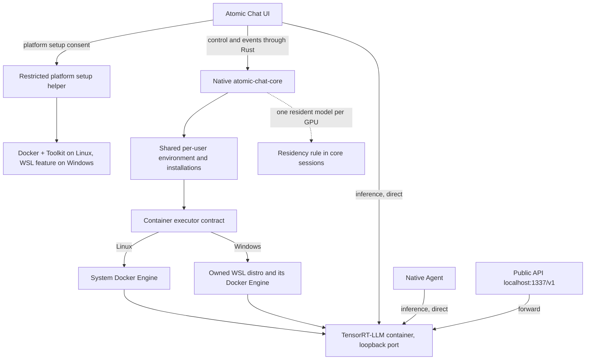

# Managed TensorRT-LLM: architecture proposal

**Status: proposed; not implemented or hardware-qualified.** Second revision, after the product
review of 2026-09-22. It replaces the earlier rootless-Docker, session-gateway and in-container
guardian design with the decisions recorded in §0. The [functional specification](2026-09-22-specify-managed-tensorrt-llm-flows.md)
defines behavior and repository seams; the [implementation plan](2026-09-22-plan-managed-tensorrt-llm-implementation.md)
orders the work and hardware gates.

- **Context:** Add an NVIDIA text engine that a user installs from Atomic Chat with one click, on
  Windows and Linux equally, for any NVIDIA GPU the engine can drive and any model the engine can
  load. Existing chat and image engines share the GPU.
- **Proposed decision:** The native core owns setup, artifacts, execution and recovery. Run the
  pinned upstream TensorRT-LLM OCI image through Docker Engine: the system Docker on Linux
  (adopted when present and GPU-capable, installed by a privileged helper otherwise), a dedicated
  Docker inside an owned WSL2 distribution on Windows. One environment per machine user, shared by
  the app and CLI cores. The app owns the UI and the OS elevation interaction.
- **Consequences:** One model software stack, two host integration paths. Loading a model on one
  engine unloads every other local GPU model, including a model that is generating. Container
  provisioning, privileges, disk use and orphan cleanup are substantive work.
- **Owner:** team; awaiting the hardware experiment on the available 4070 hosts and the 5090.

## 0. Product decisions of 2026-09-22 (supersede the first revision)

| Topic | First revision | Decision now |
| --- | --- | --- |
| Hardware and models | Qualified combinations only, `experimental` elsewhere | Universal: every NVIDIA GPU the engine supports, every model whose architecture the engine implements and whose weights fit the card. The app filters by compute capability and VRAM; a curated list is a convenience, not a gate. |
| Request accounting | Core-owned session gateway proxying every local caller | None. Switching the active model interrupts generation; that is accepted behavior. Callers reach the backend directly, as with llama.cpp today. |
| GPU policy | Coordinator with request leases, draining, activity-unknown | One rule: one resident local GPU model per GPU. Any load first unloads every other local GPU session of every provider and waits for confirmed exit. |
| Linux container engine | Owned rootless Docker + CDI per data scope | System Docker Engine. Adopt an existing one when `docker run --gpus` works; otherwise a privileged helper installs `docker-ce` + NVIDIA Container Toolkit and adds the user to the `docker` group. |
| Container watchdog | Compiled core binary as PID 1 with a lease protocol | A shell entrypoint watching a heartbeat file the core touches. Stale heartbeat kills the server and exits the container. |
| Catalog trust | Signed Ed25519 metadata, key custody | HTTPS to the release repository, digest pinned in the descriptor, same trust as the llama.cpp manifest today. Signing is deferred work. |
| Environment ownership | One environment per core data scope | One per machine user, shared by app and CLI scopes. Containers, journals and model artifacts stay per scope. |
| Linux helper trust | Separately proven root-owned delivery | Same trust as the app binary: `pkexec` on the helper shipped inside the app bundle. |
| Windows and Linux | Linux first, Windows later | Equal release targets. The first live chat still lands on Ubuntu because its chain is shorter. |

## 1. Scope and verified starting point

Future vLLM and SGLang adapters are anticipated by the [shared managed-text infrastructure](2026-09-22-share-managed-text-runtime-infrastructure.md).
Implement engine-neutral environment/container/model/UI services now, with TensorRT-LLM as the only
initial real adapter. Image generation and VisualGen are excluded; existing image code is touched
only by the one-resident-model rule and reused for setup presentation.

Targets: Windows 11 x64 with WSL2 and Ubuntu 24.04 x86_64 with systemd, NVIDIA GPU. Other Linux
distributions need their own installer recipe; the container removes engine dependency variation
but not host-installer variation. Windows 10, ARM, Podman, macOS, mobile and multi-GPU inference
are outside the first release.

Reviewed app `main` at `41145212d6b578b12ce01a82e976c658b5d1a132` (image generation is merged),
core `feat/tenzor-rt` at `46151cc3dd4b88c8b4d2a579ca90c175351cad52`; app core pin is `0.3.0`.

Existing facts, verified from code:

- Desktop runtimes and the public API belong to the core; webview control goes through Rust with a
  hidden control credential. App and CLI have isolated data scopes and exit behavior. [C1]
- Images are core diffusion jobs; execution accepts only `sd-cpp`. [C2]
- ModelFactory, Agent, voice and the Agent embedding bridge call backend ports directly. Session
  identity is host-PID based. [C4, C10]
- llama.cpp auto-unloads other llama.cpp text models before a load (`load-plan.ts`); MLX and
  diffusion have their own unload paths. There is no cross-provider GPU rule today. [C8]

Vocabulary. An **environment** is the owned container engine configuration and storage, plus the
WSL distribution on Windows; one per machine user. A **runtime package** identifies one engine's
OCI image and compiled-adapter launch policy through a **descriptor**. A **runtime installation**
binds a package to the environment with its own update/rollback state; one environment hosts many
installations. A **model artifact** is an immutable checkpoint revision in one scope's storage. A
**session** binds an installation and artifact to a running container; its identity includes the
provider. TensorRT-LLM 1.x runs Hugging Face checkpoints through its PyTorch backend; no `.engine`
compilation step is required. [N4]

## 2. Architecture and ownership

Core: availability, setup ledger, downloads, image verification, model compatibility, execution,
readiness, unload, residency rule, logs, recovery, update and data lifecycle. App/Tauri: setup
screens, progress/errors, OS elevation interaction, settings/catalog integration and data-move UX.
The core independently re-probes the result of any privileged operation.

One executor contract covers probe, pull/inspect, create/start/stop/remove, logs and health. Its
adapters are local Docker and Docker inside the owned WSL distribution. Commands are explicit
argv arrays with an explicit socket/config; never a shell and never the user's Docker context.

Provider `tensorrt-llm` implements `LocalRuntime` through a shared managed-text lifecycle and a
compiled engine adapter. Future adapters supply their own validation, argv, readiness and
capabilities. Descriptors cannot carry code or shell commands.

Inference callers keep today's shape: the session exposes a loopback `host:port` and callers speak
OpenAI-compatible HTTP to it. `trtllm-serve` does not enforce an API key [N2]; the port is bound to
loopback only, on Linux directly and on Windows through WSL's localhost forwarding.

## 3. Universal hardware and model policy

NVIDIA's supported-hardware page lists datacenter parts only (A100, L40, H100, B200, DGX Spark)
[N7]; GeForce cards share the same compute capabilities (Ada sm89, Blackwell sm120) and run the
same image, but the vendor gives no consumer guarantee. Our qualification on RTX 4070 and RTX 5090
is the evidence for consumer cards. Volta and Turing are below the engine's floor.

Model compatibility is computed, not curated:

1. `config.json` `architectures` must intersect the release's supported class list, taken from the
   PyTorch-backend model table [N3]. GGUF is never accepted by this engine.
2. `quantization_config` (ModelOpt FP8, NVFP4, AWQ, GPTQ) maps to a minimum compute capability from
   the release's quantization matrix [N6]: NVFP4 needs sm120 or sm100; FP8 weights need Ada or
   newer as measured in the experiment; Ampere gets W4A16 only. Unknown formats are rejected with
   the reason.
3. Weight bytes (from the repository file inventory) plus a KV-cache reserve must fit the measured
   free VRAM; otherwise the model is shown as too large for this card, with the number.

A curated list in the release descriptor lists checkpoints known to work per VRAM tier, including
NVIDIA's pre-quantized `nvidia/*-FP8` and `*-NVFP4` repositories [N6]. The user may paste any
Hugging Face repository; the same three checks run before any download.

## 4. Container package and release choice

**Experiment candidate:** `nvcr.io/nvidia/tensorrt-llm/release:1.3.0rc27`, linux/amd64 digest
`sha256:f7753134fa2049d4fccbcc2e73258d5c71c6dd34d06ec5be38ae750cf6ca121d`, 16.03 GB compressed
per NGC. It is a pre-release; rc27 notes an SM120/SM121 NVFP4 initialization issue for some
models. The production descriptor records the exact image, platform, measured driver/GPU/model
results and exclusions. Never resolve `latest` on a user's machine. [N10, N11]

Pull the upstream image directly from NGC. The release catalog (atomic-chat-conf) supplies the
descriptor: image digest, requirements, supported architectures, quantization matrix, curated
models. It does not mirror the image. Retain NGC's container terms and required notices in the
setup summary; model licenses stay separate. [N11, N12]

Model files stay outside the container's writable layer: read-only mounts of validated artifact
revisions, explicit writable cache/output directories. CUDA user-space libraries come from the
image; the driver and the container engine are host prerequisites.

## 5. Provisioning and privileges

### Linux

Probe: Docker CLI and daemon reachable, NVIDIA driver present, `docker run --rm --gpus all
<image> nvidia-smi` succeeds against a small test image, user in `docker` group. If everything
passes, the existing installation is adopted as-is: no daemon restart, no `daemon.json` rewrite,
no package changes.

Otherwise the app runs the bundled helper through `pkexec` with one enumerated action:
`linux.install-container-runtime`. It installs `docker-ce`, `docker-ce-cli`, `containerd.io` and
`nvidia-container-toolkit` from their vendor repositories, runs `nvidia-ctk runtime configure`,
enables and starts `docker.service`, and adds the invoking user to the `docker` group. It removes
no packages and never restarts a daemon that already served containers. The helper's trust equals
the app's: it ships inside the bundle and is invoked by path; the polkit prompt is the consent.
Group membership takes effect at the next login, so the operation persists `relogin-required`
and resumes after the user signs in again. Driver installation is a prerequisite remediation
shown to the user, not performed by the helper. [D4, D6]

### Windows

Normal-user core -> owned WSL2 Ubuntu distribution -> dedicated Docker Engine -> the same image.
Docker Desktop is not required. The elevated helper enables the WSL and Virtual Machine Platform
features only; the core imports the distribution as the original user, configures systemd
explicitly and installs the pinned Docker Engine and Toolkit inside the guest. Persist
`reboot-required` and resume on the next launch. Windows supplies the NVIDIA driver; no Linux
display driver is installed in the guest. [M1-M3, M7, N5]

Docker and file operations inside the guest run as `wsl.exe -d <distro> --exec <argv>` from the
core; there is no guest daemon of our own and the Docker socket is never exposed over TCP. Only
the owned distribution is started or stopped. Existing user distributions and Docker Desktop are
left alone.

## 6. Container identity, watchdog, storage and lifecycle

Journal a discriminated execution identity: native process, local container or WSL container.
Container identity includes engine identity, full container ID, environment ID, scope, image
digest, creation time and core instance; Windows adds the distribution name. Labels help discovery
but never authorize a stop. Killing a Docker CLI or `wsl.exe` process does not stop a container.

Model containers get no Docker socket, no privileged mode and no arbitrary host mounts. Ports are
published on loopback only. Shared memory is an explicit bounded size chosen in the experiment;
`--ipc=host` is not copied from upstream examples. [D5]

**Watchdog.** The container's entrypoint is a shell script shipped as a verified Atomic artifact and
bind-mounted read-only. It starts `trtllm-serve` as a child and polls a heartbeat file in a
writable bind mount; the core touches that file every few seconds while the session is alive. A
heartbeat older than the configured limit makes the script kill the server and exit; the container
runs with `--restart=no`. A core crash therefore frees the GPU within the limit even if Docker
survives. On restart the core reconciles recorded containers before offering any session. Every
unload waits for confirmed container exit before releasing the residency reservation.

Storage: the environment and installation records live in a per-user shared root beside the scope
roots; model artifacts, executions, caches and operations live under each scope's data root.
Never interpret a guest path as a Windows path. Model downloads materialize a complete revision
with config/tokenizer/shard inventory and are committed only after verification.

Update one installation: pull and verify candidate -> unload the resident model if any -> smoke
test with the selected model -> activate -> keep the previous digest for rollback. Runtime removal
preserves other installations, the environment and referenced artifacts; environment removal is
refused while installations remain. No global `docker prune`, no WSL shutdown, no removal of the
system Docker.

Data move/reset: quiesce owned sessions; move scope data; the shared environment is not moved.
Full app exit stops its containers; tray mode keeps them; the CLI scope is independent. [C1, C7]

## 7. GPU residency rule

There is one rule and it lives in the core's session owner: before any local GPU model loads
(llama.cpp CUDA/Vulkan, MLX, sd.cpp or a managed container), every other local GPU session in the
scope is unloaded, whether idle or generating, and the new load waits for each confirmed exit.
Interrupted callers receive the ordinary connection error. The reservation for a loading or
resident model is released only by confirmed process or container exit; a failed stop keeps it
and reports the failure. CPU-only sessions do not take the GPU.

Other processes and the separate CLI core are external consumers: the core never terminates them.
If the engine fails to allocate memory, the load reports out-of-memory with the measured numbers.

Rejected: the first revision's session gateway and request leases. They would have protected a
generating model from eviction at the cost of proxying every local request and rewriting five
callers; the product decision is that switching models may interrupt generation.

## 8. Remaining gates

- RTX 4070 on Ubuntu and RTX 4070 on Windows (available now): image pull, a small FP16/BF16 model,
  FP8 checkpoint behavior on Ada, cancellation/unload, VRAM recovery, system Docker adoption and
  fresh helper install, WSL import and loopback chain.
- RTX 5090 (available soon): NVFP4 checkpoints, the rc27 SM120 known issue, compute-capability
  filter evidence.
- Exact Docker/Toolkit/guest versions, NGC pull behavior without credentials, disk requirements,
  shared-memory size, watchdog limits.

## Evidence

### Repository sources

- **C1:** [desktop runtime ownership](2026-09-17-the-core-owns-every-desktop-runtime-unconditionally.md),
  [app/CLI isolation](2026-09-17-isolate-app-and-cli-cores.md),
  [Rust control bridge](2026-09-16-the-webview-reaches-the-core-only-through-rust.md).
- **C2:** [image migration](2026-09-18-image-generation-load-cancel-and-remote-access-run-in-the-core.md),
  [diffusion service](../../../atomic-chat-core/src/diffusion/service.ts).
- **C4:** [ModelFactory](../../web-app/src/lib/model-factory.ts),
  [Agent target](../../src-tauri/src/core/agent/target.rs),
  [process journal](../../../atomic-chat-core/src/lock/process-journal.ts).
- **C5:** [runtime contract](../../../atomic-chat-core/src/runtime/shared/local-runtime.ts),
  [sessions](../../../atomic-chat-core/src/contracts/session.ts),
  [core wiring](../../../atomic-chat-core/src/core/create.ts).
- **C7:** [app data move](../../src-tauri/src/core/app/commands.rs),
  [core paths](../../../atomic-chat-core/src/config/paths.ts).
- **C8:** [core model transitions](../../../atomic-chat-core/src/core/sessions.ts),
  [llama.cpp load plan](../../../atomic-chat-core/src/runtime/llamacpp/load-plan.ts),
  [MLX runtime](../../../atomic-chat-core/src/runtime/mlx/runtime.ts),
  [image idle unload](../../../atomic-chat-core/src/diffusion/idle.ts).
- **C10:** [voice session target](../../web-app/src/lib/voice/engine.ts),
  [Agent embedding bridge](../../src-tauri/src/core/agent/rag_bridge.rs).

### Upstream sources checked on 2026-09-22

- **M1:** [Microsoft: install WSL](https://learn.microsoft.com/en-us/windows/wsl/install).
- **M2:** [Microsoft: WSL commands](https://learn.microsoft.com/en-us/windows/wsl/basic-commands).
- **M3:** [Microsoft: import a distribution](https://learn.microsoft.com/en-us/windows/wsl/use-custom-distro).
- **M5:** [Microsoft: WSL networking](https://learn.microsoft.com/en-us/windows/wsl/networking).
- **M7:** [Microsoft: systemd in WSL](https://learn.microsoft.com/en-us/windows/wsl/systemd).
- **N2:** [NVIDIA: trtllm-serve](https://nvidia.github.io/TensorRT-LLM/latest/commands/trtllm-serve/trtllm-serve.html):
  model by HF id or path, `--host/--port`, `--backend pytorch`, `--max_seq_len`,
  `--kv_cache_free_gpu_memory_fraction`, `--config` YAML; `/v1/chat/completions`, `/v1/completions`,
  `/v1/responses`, `/health`, `/metrics`, `/version`; no enforced API key.
- **N3:** [NVIDIA: supported models, PyTorch backend](https://nvidia.github.io/TensorRT-LLM/latest/models/supported-models.html):
  identification by `config.json` architecture class name.
- **N4:** [NVIDIA: legacy TensorRT backend removal](https://nvidia.github.io/TensorRT-LLM/latest/legacy/tensorrt-backend-removal.html).
- **N5:** [NVIDIA: CUDA on WSL](https://docs.nvidia.com/cuda/wsl-user-guide/).
- **N6:** [NVIDIA: quantization](https://nvidia.github.io/TensorRT-LLM/latest/features/quantization.html):
  NVFP4 on sm120/sm100; Ampere limited to W4A16 and FP8 KV cache; pre-quantized ModelOpt
  checkpoints load directly from Hugging Face.
- **N7:** [NVIDIA: supported hardware](https://nvidia.github.io/TensorRT-LLM/latest/supported-hardware.html):
  datacenter parts only are listed.
- **N10:** [NVIDIA: rc27 release and known issues](https://github.com/NVIDIA/TensorRT-LLM/releases/tag/v1.3.0rc27).
- **N11:** [NGC: rc27 image manifests](https://catalog.ngc.nvidia.com/orgs/nvidia/tensorrt-llm/containers/release/1.3.0rc27/tags).
- **N12:** [NVIDIA software agreement](https://www.nvidia.com/en-us/agreements/enterprise-software/nvidia-software-license-agreement/).
- **D4:** [NVIDIA: Container Toolkit installation](https://docs.nvidia.com/datacenter/cloud-native/container-toolkit/latest/install-guide.html).
- **D5:** [Docker: port publishing](https://docs.docker.com/engine/network/port-publishing/).
- **D6:** [Docker: Ubuntu installation](https://docs.docker.com/engine/install/ubuntu/).
