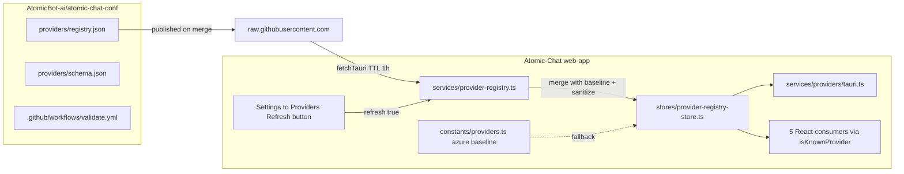

# Provider Registry — Agent Notes

> **Scope**: this document applies when editing files that participate in the
> remote provider-registry feature:
>
> - [provider-registry.ts](./provider-registry.ts) — the network loader.
> - [providers/tauri.ts](./providers/tauri.ts) — desktop providers service.
> - [providers/default.ts](./providers/default.ts) / [providers/types.ts](./providers/types.ts).
> - [../stores/provider-registry-store.ts](../stores/provider-registry-store.ts) — Zustand wrapper.
> - [../constants/providers.ts](../constants/providers.ts) — bundled baseline (Azure + `openAIProviderSettings`).
>
> It does **not** apply to unrelated services in this folder (extensions, MCP,
> hardware, etc.). For those, follow the rules in their own AGENTS.md, if any,
> or the project root guidance.

## Why this exists

Most cloud providers (OpenAI, Anthropic, OpenRouter, Mistral, Groq, xAI,
Gemini, MiniMax, Hugging Face, NVIDIA, …) are no longer hard-coded in the
TypeScript source. They live in a public Git registry,
[AtomicBot-ai/atomic-chat-conf](https://github.com/AtomicBot-ai/atomic-chat-conf),
under `providers/registry.json`. The desktop client fetches that file at
startup, caches it for one hour, and falls back to a small bundled baseline
when the network is unreachable. Adding a new provider or model now means
opening a Pull Request against the registry repo — no app release required.

## Data flow



## Where things live

| Concern                                  | File                                                                                                |
| ---------------------------------------- | --------------------------------------------------------------------------------------------------- |
| Remote manifest                          | `AtomicBot-ai/atomic-chat-conf/providers/registry.json`                                             |
| JSON Schema for the manifest             | `AtomicBot-ai/atomic-chat-conf/providers/schema.json`                                               |
| Loader (fetch, cache, sanitize, fallback)| [provider-registry.ts](./provider-registry.ts)                                                      |
| Zustand store + auto-bootstrap           | [../stores/provider-registry-store.ts](../stores/provider-registry-store.ts)                        |
| Sync helper for non-React code           | `getRegistryProvidersSync()` in the same store                                                      |
| Bundled baseline (Azure + custom-form)   | [../constants/providers.ts](../constants/providers.ts) (`BASELINE_PROVIDERS`, `openAIProviderSettings`) |
| Desktop providers service                | [providers/tauri.ts](./providers/tauri.ts) — uses `ensureRegistryLoaded()`                          |
| UI refresh button + last-updated label   | [../routes/settings/providers/index.tsx](../routes/settings/providers/index.tsx)                    |
| Locale strings (`provider:registry.*`)   | `../locales/*/providers.json` (13 locales)                                                          |
| Loader tests                             | [./__tests__/provider-registry.test.ts](./__tests__/provider-registry.test.ts)                      |

### Consumer files migrated to `isKnownProvider`

These five files used to import `predefinedProviders` to test "is this
provider system-defined?". They now ask the registry store via
`isKnownProvider(name)`:

- [../routes/index.tsx](../routes/index.tsx)
- [../routes/settings/providers/$providerName.tsx](../routes/settings/providers/$providerName.tsx)
- [../containers/DropdownModelProvider.tsx](../containers/DropdownModelProvider.tsx)
- [../containers/dialogs/DeleteProvider.tsx](../containers/dialogs/DeleteProvider.tsx)
- [../hooks/useJanModelPrompt.ts](../hooks/useJanModelPrompt.ts)

## Schema versioning

The manifest carries `schema_version`. The client embeds
`SUPPORTED_SCHEMA_VERSION` in `provider-registry.ts`. Rules:

- **Bump `SUPPORTED_SCHEMA_VERSION` _before_ shipping a manifest with a
  higher version.** Otherwise old clients reject the new manifest and stay on
  the cached/baseline copy.
- Adding a new provider or a new model is **not** a schema change.
- Adding/removing required fields, changing field types, or renaming fields
  on `provider`/`model`/`providerSetting` IS a schema change — bump it.
- Always update `providers/schema.json` in the registry repo when you change
  the shape, and re-run `ajv validate` locally.

## Cache rules

- TTL: `CACHE_TTL_MS = 60 * 60 * 1000` (1 hour).
- Keys in `localStorage`:
  - `jan_provider_registry_cache_v1` — JSON-stringified manifest.
  - `jan_provider_registry_cache_ts_v1` — number, `Date.now()` at write time.
- `clearRegistryCache()` wipes both keys; tests use it for isolation.
- The Refresh button in Settings → Providers calls `refresh({ force: true })`,
  which bypasses freshness and writes a new cache entry on success.
- A stale cache (`isCacheFresh === false`) is still used as **fallback** if
  the network attempt fails. Only when there is no cache at all do we fall
  through to `BASELINE_PROVIDERS`.

## Failure modes (and what to render)

| Trigger                                | Source returned | UI behavior                                                  |
| -------------------------------------- | --------------- | ------------------------------------------------------------ |
| Fresh cache present, no force          | `cache`         | Silent — same providers shown.                               |
| Fetch succeeds                         | `remote`        | Silent. Cache and store are updated.                         |
| Fetch fails, stale cache exists        | `cache`         | Silent. `error` field is set so explicit Refresh shows toast.|
| Fetch fails, no cache                  | `baseline`      | Silent (Azure-only catalog). User can add custom providers.  |
| `schema_version` exceeds support       | `baseline`      | Silent. Encourage update via separate UX (future work).      |
| Manifest payload malformed             | `baseline`      | Silent. Logged via `console.warn`.                           |
| Tauri fetch unavailable (web/test env) | uses `globalThis.fetch` | Same outcomes as above.                              |

`getProvidersOrFallback()` is documented as **never throwing** — UI code must
not wrap it in `try/catch` for control flow.

## How to add a provider

### For non-developers (preferred path)

1. Open `providers/registry.json` in `AtomicBot-ai/atomic-chat-conf` on GitHub.
2. Click **Edit**, append a new entry, bump `updated_at`, open a PR.
3. CI (`ajv validate` + the integrity script) must be green before merge.
4. After merge, every Jan client picks up the change within an hour, or
   immediately on Settings → Providers → **Refresh catalog**.

### For developers (only when shape changes)

1. Update [./provider-registry.ts](./provider-registry.ts):
   - Bump `SUPPORTED_SCHEMA_VERSION` if breaking.
   - Add new field handling in `sanitizeProvider` / `isManifest`.
2. Update `providers/schema.json` in the registry repo.
3. Ship the client first (so deployed clients can read the new shape).
4. Then publish the registry change.

## Do NOT

- **Do not** restore the old `predefinedProviders` array. Use
  `useProviderRegistryStore` (React) or `getRegistryProvidersSync()` /
  `ensureRegistryLoaded()` (non-React).
- **Do not** put `api_key` values in the manifest. The loader strips them on
  every fetch (`sanitizeProvider`), but committing one is still a security
  incident — rotate the key immediately.
- **Do not** delete `azure` or `openAIProviderSettings` from
  `BASELINE_PROVIDERS`. Azure cannot live in the shared registry (its
  `base_url` is per-customer), and `openAIProviderSettings` is the form
  template the "Add Provider" dialog clones for custom providers.
- **Do not** call `getProvidersOrFallback()` from render-critical code paths
  on every render. Use the store (`useProviderRegistryStore(s => s.providers)`)
  so a single fetch backs every component.
- **Do not** edit `registry.json` inside `Atomic-Chat`. It does not exist
  here. The single source of truth is the `atomic-chat-conf` repo.
- **Do not** widen the cache TTL beyond 24h without coordinating with
  release/communications — users expect changes within an hour.

## Tests

Run only the relevant suites while iterating:

```bash
npx vitest run src/services/__tests__/provider-registry.test.ts
npx vitest run src/routes/settings/providers/__tests__/index.test.tsx
npx vitest run src/containers/__tests__/DropdownModelProvider.displayName.test.tsx
```

The full suite has pre-existing unrelated failures
(`models.test.ts`, `useReleaseNotes.test.ts`, `interface.test.tsx`,
`SettingsMenu.test.tsx`, `utils.test.ts > getProviderTitle`); investigate
those independently, do not block registry work on them.
